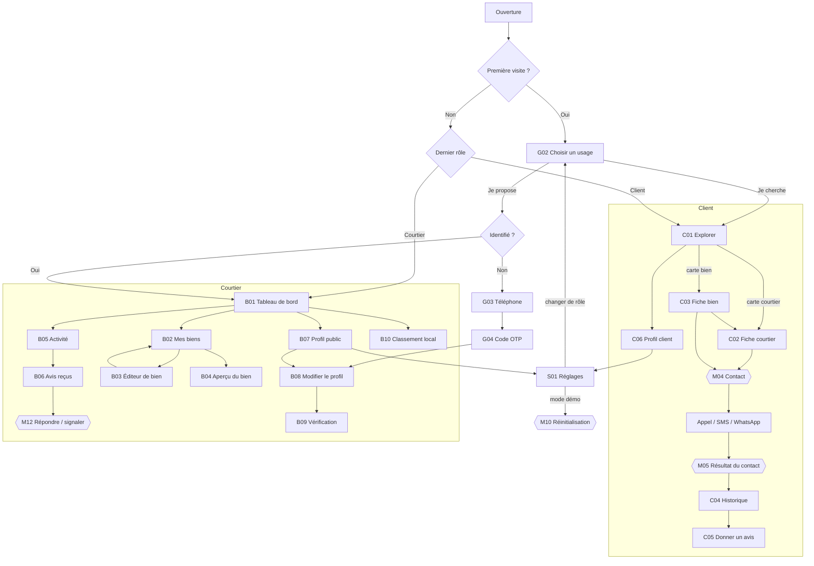
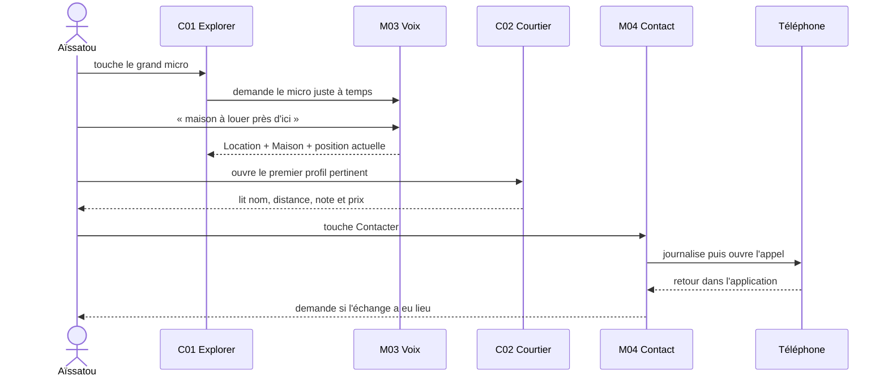
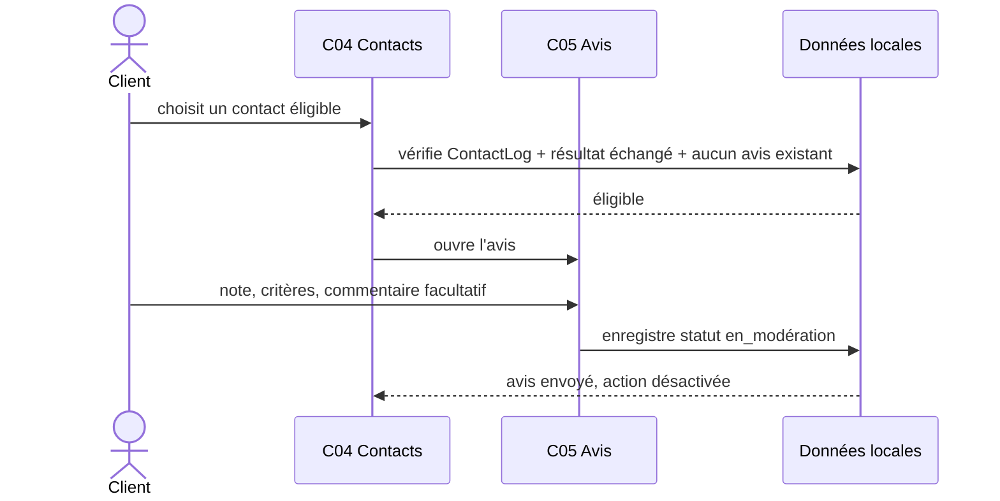
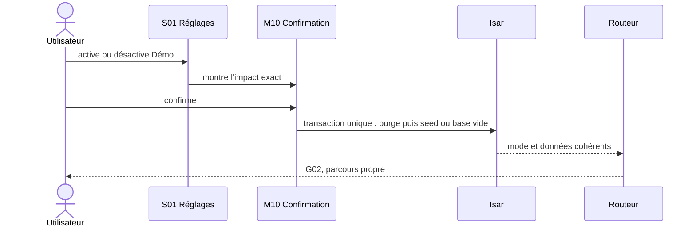

# Woutalma Keur — Architecture UX mobile

Version 1.0 — source de vérité des écrans, parcours et interactions.

Ce document répond à une seule question avant toute implémentation Flutter : **où se trouve chaque
fonction du cahier des charges, comment l'utilisateur y arrive, et comment il en sort ?**
`DESIGN.md` définit l'apparence. `WOUTALMA-UI.md` définit les règles Flutter. Ce fichier définit le
produit navigable.

Les contrats détaillés des trois écrans de référence vivent dans `screen-contracts/`. Ils
complètent ce registre sans dupliquer un document par écran simple.

`INTERACTION-FEEDBACK.md` audite chaque ID ci-dessous et définit validation, mouvement,
haptique, son, parole et récupération. Un écran n'est pas complet si une action significative peut
sembler ignorée.

## 1. Audit du travail initial

### Ce qui est déjà solide

- La cible peu lectrice, le réseau faible et l'usage au soleil guident réellement le design.
- Les actions ont de grandes cibles, des pictogrammes, des libellés et des `Semantics`.
- Les menus déroulants, dialogues et composants Material génériques ont des remplaçants précis.
- Le vocal est pensé comme un chemin parallèle et remplaçable derrière `VoiceService`.
- Les états vide, chargement, peuplé et erreur sont exigés.

### Gaps corrigés ou couverts ici

| Gap trouvé | Décision |
|:--|:--|
| Manrope imposée alors que la demande est la typographie système | Roboto/SF via `ThemeData`, aucune police embarquée |
| Riverpod utilisé alors que le choix est Provider | `provider` + `ChangeNotifier`, logique pure dans les services |
| Hive pour un réglage et Isar pour le reste | Isar Community uniquement |
| Aucun plan d'écrans ni comportement retour/pop | registre, routes et règles ci-dessous |
| Toutes les cartes à rayon 20 et tous les boutons en pilule | cartes à 8, boutons à 12 ; pilules réservées aux chips/badges |
| Golden obligatoire pour chaque widget | tests widget pour tous ; goldens seulement sur les fondations visuelles |
| « Chaque icône doit se comprendre seule » irréaliste | libellé visible pour toute icône ambiguë + `Semantics` toujours |
| Autorisation GPS/micro/photo/notification non placée dans le parcours | demandes juste à temps, avec refus et solution manuelle |
| Connexion, OTP et changement de rôle absents | accès invité, authentification juste avant une action identifiée |
| Modération et vérification citées sans surfaces UX | statuts et actions côté mobile ; console modérateur hors app |
| Aucun contrat clair pour le mode démo | bascule destructive confirmée, seed déterministe, retour à base vide |

## 2. Règles d'architecture UX

1. Un client peut explorer sans compte. Le téléphone est demandé au premier contact, avis ou accès
   à l'historique. On ne bloque pas la découverte avec un onboarding long.
2. Le contact est atteignable en trois écrans maximum : Explorer → Courtier → feuille Contact.
3. Liste et carte sont deux vues du même résultat, pas deux écrans ni deux onglets.
4. Les filtres, choix courts, confirmations et canaux de contact sont des bottom sheets.
5. Un détail, un formulaire long ou une étape qui doit être deep-linkable est une route poussée.
6. Le client et le courtier partagent la même application et peuvent changer de rôle depuis leur
   profil. Les shells et barres de navigation restent distincts.
7. La voix ne crée pas un second arbre d'écrans : elle commande et lit le même arbre.
8. Aucune messagerie textuelle interne n'est créée au MVP. Appel, SMS et WhatsApp s'ouvrent dans
   les applications du téléphone ; seul le journal de contact reste local.
9. Le prototype ne contient pas de console d'administration. Il simule les statuts de modération
   et de vérification nécessaires pour tester les écrans client/courtier.

## 3. Carte générale



## 4. Navigation principale

### Shell client — 3 destinations

| Destination | Route racine | Raison |
|:--|:--|:--|
| Explorer | `/client/explorer` | recherche, résultats, liste/carte, vocal |
| Contacts | `/client/contacts` | historique et accès aux avis éligibles |
| Profil | `/client/profile` | identité, réglages, changement de rôle |

### Shell courtier — 4 destinations

| Destination | Route racine | Raison |
|:--|:--|:--|
| Accueil | `/broker/home` | résumé d'activité et prochain geste |
| Biens | `/broker/properties` | liste et gestion des biens |
| Activité | `/broker/activity` | consultations, contacts et avis |
| Profil | `/broker/profile` | fiche publique, vérification, classement, réglages |

Pas d'onglet Messages : le produit n'héberge pas de messagerie. Pas d'onglet Carte : c'est un mode
de l'écran Explorer. Pas d'onglet Favoris : absent du cahier des charges MVP.

## 5. Écrans communs

| ID | Écran et décision | Contenu / fonctions | Entrées → sorties |
|:--|:--|:--|:--|
| G00 | Démarrage technique | ouvre Isar, lit rôle/mode, charge le seed si nécessaire ; écran natif seulement si >300 ms | lancement → G02, C01 ou B01 ; erreur locale → G05 |
| G01 | Langue — **hors parcours tant qu'une seule langue est livrée** | Français et les langues ajoutées, écrites dans leur propre langue, pictogramme audio et bouton Écouter par option ; aucun drapeau | G00 → G02 ; retour quitte l'app |
| G02 | Choisir un usage | « Je cherche une maison » / « Je propose des biens », illustrations pictographiques, lecture audio | G00, S01 → C01 ou G03/B01 |
| G03 | Téléphone | `WkPhoneField`, +221 présélectionné mais modifiable, raison de la demande | action identifiée → G04 ; retour reprend l'action sans la réaliser |
| G04 | Code OTP | `Pinput`, collage automatique, renvoyer avec délai, modifier le numéro | G03 → action initiale, B08 ou G05 |
| G05 | Blocage récupérable | base locale indisponible, seed invalide ou trop d'échecs OTP ; Réessayer et aide | erreur bloquante → écran précédent |
| S01 | Profil / réglages | en-tête d'identité (visiteur ou compte, bouton M'identifier, déconnexion), rôle, retours (vibrations, sons). Plus de mode démonstration ni de catalogue. | onglet Profil, engrenage de C01/B01 → G03 |
| S02 | Catalogue UI | tous les widgets et états ; visible seulement en debug ou mode démo | S01 → retour S01 |

### G01 et le choix de langue

Le prototype livre **le français seul**. Un écran de choix à une seule option coûte un écran au
lancement et n'apprend rien : **G01 sort du parcours**, et la ligne « langue » de S01 disparaît
tant qu'il n'y a rien à choisir.

G01 reste spécifié ici, et sa route `/welcome/language` reste réservée. Ce n'est pas de la dette :
c'est ce qui garantit qu'ajouter une langue est un fichier ARB plus une réactivation, et non une
reprise de l'onboarding. Le déclencheur est mécanique — **dès qu'une seconde locale est livrée,
G01 revient en tête de parcours et la ligne S01 réapparaît.**

Ce qui ne bouge pas : la cible lit toujours mal. Le chemin vocal, les pictogrammes et la lecture
d'écran à voix haute restent obligatoires, en français.

## 6. Écrans client

| ID | Écran et décision | Contenu / fonctions | Entrées → sorties |
|:--|:--|:--|:--|
| C01 | Accueil : qui ou quel bien près de moi ? | quartier actuel, `WkSearchTrigger`, rangée de catégories, rangées horizontales « Près de chez vous », « Courtiers de confiance », « Nouveautés » (`WkPropertyTile`, `WkBrokerTile`), « Voir tout » et « Carte » vers M14 ; invitation à activer la position quand le GPS manque | shell, M14, M02 → C02 ou C03 |
| C02 | Fiche courtier : puis-je lui faire confiance ? | identité vérifiée, distance, zone, note + volume, réactivité, biens disponibles, avis récents, Écouter, action Contact fixe ; la première ouverture journalise une consultation dédupliquée | C01/C03/C04 → M04, C03, liste complète des avis ; retour restitue position de liste |
| C03 | Fiche bien : ce bien correspond-il ? | photos feuilletables (`WkPhotoCarousel`), statut, prix, ligne de métadonnées, message vocal du courtier (`WkVoiceNotePlayer`, s'il existe), description, courtier, Contact fixe | C01/C02 → galerie, C02 ou M04 ; retour restitue le résultat |
| C04 | Contacts : qui ai-je déjà joint ? | regroupement par courtier, canal/date, résultat, statut « avis possible/déjà donné », recherche locale | onglet ou M05 → C02/C05 ; vide → C01 |
| C05 | Avis : comment s'est passé le contact ? | étape 1 note globale + trois critères ; étape 2 commentaire facultatif + résumé ; identité du contact rappelée | C04/M05 → confirmation puis C04 ; retour avec saisie → M09 |
| C06 | Profil client | nom facultatif, téléphone masqué, langue, raccourci Réglages, changer de rôle, suppression des données locales | onglet → G03 pour identifier, S01 ou G02 |

### États obligatoires de C01

- Localisation connue : le GPS est la position par défaut (décision du
  2026-08-14, voir `docs/screen-contracts/client-discovery.md`).
- Localisation inconnue ou refusée : adresse/quartier manuel entière et
  immédiate — jamais un parcours dégradé.
- Permission GPS refusée : aucune relance en boucle ; bouton « Choisir mon quartier ».
- Aucun résultat : élargir le rayon, enlever les filtres.
- Réseau faible : les données locales restent visibles ; la carte peut laisser place à la liste.
- Commande vocale comprise : filtres extraits visibles avant application.
- Commande ambiguë : deux ou trois interprétations dans M03, jamais une erreur textuelle seule.

## 7. Écrans courtier / agence

| ID | Écran et décision | Contenu / fonctions | Entrées → sorties |
|:--|:--|:--|:--|
| B01 | Accueil : que dois-je traiter maintenant ? | statut de vérification, vues et contacts récents, biens disponibles/réservés, avis à répondre, rang local, action Ajouter un bien | shell → B02/B03/B05/B06/B09/B10 |
| B02 | Mes biens | filtres Tous/Disponible/Réservé/Clos, cartes compactes, recherche, action Ajouter, menu d'action par bien | onglet/B01 → B03/B04/M08 ; vide → B03 |
| B03 | Ajouter ou modifier un bien | une route avec 3 étapes : bien+transaction+quartier ; titre+prix+surface+pièces+description ; photos+message vocal+publication. Quartier, surface et pièces sont des choix ; le titre est composé et corrigeable ; le vocal (45 s max, `WkVoiceNoteRecorder`) est facultatif ; pas de brouillon persistant | B02/B04 → B02 ; retour à l'étape 1 quitte |
| B04 | Aperçu et gestion du bien | rendu proche de C03, statut, modifier, partager l'aperçu, changer statut, supprimer | B02/B03 → B03/M08/M09 ; retour B02 |
| B05 | Activité | deux segments Consultations/Contacts, date, bien concerné, canal, état lu ; aucune donnée privée inutile | onglet/B01 → B06 ou B04 |
| B06 | Avis reçus | note moyenne, répartition, avis récents, réponse, signalement et statut de modération | B05/B01 → M12 ; retour restaure filtre |
| B07 | Profil public | aperçu exact de C02, statut de vérification, Modifier, Réglages, Classement | onglet/B01 → B08/B09/B10/S01 |
| B08 | Créer/modifier le profil | individuel/agence, nom, photo/logo, téléphone, WhatsApp, zone de couverture, description courte | G04/B07 → B09 ou B07 ; changements non sauvés → M09 |
| B09 | Vérification | étapes identité/registre, photo document, état en attente/validé/refusé, motif et recommencer | B01/B07/B08 → B07 ; pas de capture avant permission M06 |
| B10 | Classement local | position, zone choisie, décomposition compréhensible note/avis/proximité/réponse, conseils liés aux données réelles | B01/B07 → retour |

Le type « agence » utilise les mêmes écrans. Seuls les champs de B08/B09 et le libellé du profil
changent ; aucun second arbre d'application n'est créé.

## 8. Sheets, overlays et surfaces temporaires

| ID | Surface | Ouverture | Action et fermeture |
|:--|:--|:--|:--|
| M01 | Filtres | M14, pastille Filtres | transaction et type en pastilles, prix et rayon en curseurs ; Appliquer ferme et met M14 à jour ; Réinitialiser explicite |
| M02 | Quartier / position | C01, zone actuelle | **GPS en action principale, en tête**, puis recherche de quartier et positions récentes ; choisir ferme ; refus GPS garde la sheet ouverte en manuel |
| M03 | Voix plein écran | ~~micro global~~ **retiré de l'application** | Décision du 2026-08-14 : la reconnaissance n'était pas réelle (`SimulatedVoiceService`, script figé), et un micro qui ne comprend rien dessert précisément la cible qui ne lit pas. L'écran survit dans le catalogue S02 comme prototype, prêt à revenir dès qu'un moteur réel existe. |
| M04 | Contacter | C02/C03 | en-tête courtier (avatar, réactivité, badges) puis un canal par ligne : Appeler, WhatsApp, SMS, chacun avec son pictogramme coloré et son sous-titre ; si invité → G03 puis réouverture ; canal choisi journalisé avant ouverture externe |
| M05 | Résultat du contact | retour d'une app externe ou historique | « J'ai échangé » rend l'avis éligible ; « Pas de réponse » conserve le journal sans avis immédiat ; Plus tard ferme |
| M06 | Permission expliquée | premier lancement (position) puis toute demande photo/notification | Continuer déclenche le prompt système ; Pas maintenant ferme vers l'alternative manuelle ; présentée **une seule fois**, un refus ne se redemande pas |
| M07 | Sélecteur d'option | tout `WkSelectField` | ligne 56+, icône, libellé, coche ; sélection ferme et restitue la valeur |
| M08 | Statut du bien | B02/B04 | disponible/réservé/vendu-loué avec impact expliqué ; changement confirmé met à jour les recherches |
| M09 | Confirmation contextuelle | suppression, sortie formulaire, changement mode | nomme objet et conséquence ; action destructive séparée de l'annulation |
| M10 | Réinitialiser le mode | S01, toggle Démo | affiche nombre d'éléments supprimés ; confirmer purge Isar, seed ou base vide, puis `go` vers G02 |
| M11 | Source photo | B03/B08/B09 | appareil/photo ; permission juste à temps ; compression avant persistance |
| M12 | Répondre / signaler un avis | B06 | réponse publique facultative ou motif de signalement ; affiche ensuite le statut de modération |
| M13 | Toast accessible | succès non bloquant | annonce TalkBack, durée suffisante, aucune action critique uniquement dans le toast |
| M14 | Résultats | C01 : barre, catégorie, « Voir tout » ou « Carte » | `WkSearchBar`, pastilles rapides (À louer/À vendre/types) et Filtres → M01, segments Biens/Courtiers, compteur, Liste/Carte ; les résultats se mettent à jour pendant la frappe et s'ouvrent directement ; retour ferme, la requête survit |

Une sheet non destructive peut être balayée vers le bas. Une saisie, un enregistrement vocal ou
une action destructive demande confirmation avant de perdre des données.

## 9. Parcours de référence

### Aïssatou — recherche vocale et appel



### Client — avis vérifié



### Moussa — publier un bien

```mermaid
sequenceDiagram
  actor M as Moussa
  participant L as B02 Mes biens
  participant E as B03 Éditeur
  participant S as Serveur
  participant P as B04 Aperçu
  M->>L: Ajouter un bien
  L->>E: étape 1 — transaction, type, quartier
  E->>E: compose le titre à partir des choix
  M->>E: étape 2 — prix, surface, pièces ; étape 3 — photos
  E->>S: enregistre le bien, statut Disponible
  S-->>L: retour à B02, qui se recharge
  L->>P: ouvrir l'aperçu du bien publié
  Note over S: le bien alimente C01 et C02
```

### Bascule du mode démo



## 10. Contrat `go_router`

```text
/
├── /welcome/language                         G01 (inactif — voir §5)
├── /welcome/role                             G02
├── /auth/phone?returnTo=...                  G03
├── /auth/otp?returnTo=...                    G04
├── /client                                   StatefulShellRoute
│   ├── /client/explorer                      C01
│   │   ├── /client/explorer/brokers/:brokerId C02
│   │   └── /client/explorer/properties/:id    C03
│   ├── /client/contacts                      C04
│   │   └── /client/contacts/:contactId/review C05
│   └── /client/profile                       C06
├── /broker                                   StatefulShellRoute
│   ├── /broker/home                          B01
│   ├── /broker/properties                    B02
│   │   ├── /broker/properties/new            B03
│   │   ├── /broker/properties/:id             B04
│   │   └── /broker/properties/:id/edit        B03
│   ├── /broker/activity                      B05
│   │   └── /broker/reviews                    B06
│   └── /broker/profile                       B07
│       ├── /broker/profile/edit               B08
│       ├── /broker/profile/verification       B09
│       └── /broker/profile/ranking            B10
├── /settings                                 S01
└── /settings/catalog                         S02 (debug/demo)
```

- `go()` change un onglet ou remet une racine après onboarding/mode démo.
- `push()` ouvre détail, avis, édition, vérification, classement et réglages.
- `showModalBottomSheet()` n'est utilisé que par M01–M12 via un helper partagé ; aucune sheet ne
  devient une route cachée.
- Les transitions de page restent celles de la plateforme. Seul M03 utilise un fondu court.
- Retour depuis C02/C03/B04 conserve recherche, filtres, segment, carte/liste et position de scroll.
- Retour depuis B08/C05 avec modifications ouvre M09. Sans modification, `pop()` direct.
  B03 en est exclu : il n'a pas de brouillon persistant à protéger, son retour recule d'une étape
  puis quitte (voir `screen-contracts/property-editor.md`, § Conflits résolus).
- Retour depuis M03 pendant écoute stoppe d'abord le service vocal puis ferme l'overlay.
- Un deep link vers une donnée absente ouvre `WkErrorState` dans la route demandée, puis revient à
  la racine du rôle ; il ne redirige pas silencieusement.
- Le bouton système Retour à la racine d'un onglet revient à l'onglet précédent du shell ; à la
  racine Explorer/Accueil il laisse Android fermer l'application.

## 11. Machine d'états transverse

Tout écran asynchrone expose exactement `initial/loading/data/empty/error`. Les mutations exposent
`idle/submitting/success/failure`. Les écrans ne déduisent pas un chargement avec `data == null`.

| Événement | Avant | Après | Effet visible |
|:--|:--|:--|:--|
| Activer Démo | réel | transaction Isar | retour G02 avec seed complet |
| Désactiver Démo | démo | transaction Isar | retour G02 avec base vide |
| Bien Disponible → Clos | visible recherche | exclu recherche | toast + listes invalidées |
| Contact lancé | aucun journal | `attempted` | ligne C04, pas encore d'avis |
| Échange confirmé | `attempted` | `reached` | avis autorisé une fois |
| Avis envoyé | `reached` | `reviewPending` | statut En modération |
| Profil soumis | brouillon/refusé | en attente | publication verrouillée jusqu'au seed de validation |
| GPS refusé | inconnu | refusé | saisie quartier, jamais écran bloqué |

## 12. Inventaire des composants partagés

Construire et valider d'abord les fondations réellement réutilisées. Le catalogue S02 sert de
fixture visuelle ; il n'autorise pas à créer des composants spéculatifs.

### Lot 1 — avant tout écran

| Composant | Contrat minimal |
|:--|:--|
| `WkScaffold` | safe areas, fond, top bar optionnelle, bottom action/nav, clavier |
| `WkTopBar` | retour, titre, écoute, une action maximum |
| `WkButton` | primary/secondary/ghost/danger/call/whatsapp, icône, loading, disabled |
| `WkIconButton` | 56 dp, tooltip + semantics |
| `WkBottomNav` | shell client/courtier, icône + libellé, badge facultatif |
| `WkTextField` | label persistant, aide/erreur, dictée facultative |
| `WkSelectField` + `WkOptionSheet` | jamais de dropdown Material |
| `WkLoadingState`, `WkEmptyState`, `WkErrorState` | même emplacement et sans saut de layout |
| `WkConfirmSheet` | neutre ou destructive, perte de saisie gérée |
| `WkToast` | message court annoncé par lecteur d'écran |

### Lot 2 — avant Explorer et détails

| Composant | Contrat minimal |
|:--|:--|
| `WkSearchBar` | texte, effacer, voix, soumission ; n'apparaît que sur un écran dont la recherche est le sujet (M14) |
| `WkSearchTrigger` | allure d'une barre, pas de clavier : ouvre M14, expose le micro, affiche la requête en cours |
| `WkAvatar` | initiales sur jeton de marque ou photo déposée ; disque pour une personne, carré arrondi pour une agence — la forme porte le type, pas la couleur |
| `WkSegmentedControl<T>` | liste/carte et courtiers/biens ; état lisible sans couleur |
| `WkFilterChip` | sélection, suppression, compteur |
| `WkBrokerCard` | nom, distance, note, vérifié, disponibilité, ouverture ; pas de bouton contact miniature |
| `WkPropertyCard` | photo/placeholder, prix, type, statut, distance |
| `WkRatingDisplay` | chiffre, volume et étoiles décoratives regroupées en une sémantique |
| `WkBadge` | icône + mot + couleur |
| `WkInfoRow` | icône, libellé, valeur, action facultative |
| `WkBottomActionBar` | action primaire fixe sans couvrir le dernier contenu |
| `WkVoiceButton` + `WkVoiceOverlay` | idle/listening/processing/result/error, haptique |

### Lot 3 — avant authentification et gestion

| Composant | Package plutôt que code maison |
|:--|:--|
| `WkPhoneField` | enveloppe `phone_form_field` avec tokens/semantics Woutalma |
| `WkOtpField` | enveloppe `pinput` |
| `WkPhotoPicker` | `image_picker` + `flutter_image_compress`, limite/poids visibles |
| `WkAudioRecorderTile` | `record`, durée et annulation |
| `WkAudioPlayerTile` | `just_audio`, lecture/pause/vitesse |
| `WkLocationPicker` | `geolocator` + `flutter_map`, saisie manuelle toujours disponible |
| `WkRatingInput` | widget local : cinq grandes cibles, clavier/semantics ; une dépendance rating n'apporte rien |
| `WkStepHeader` | progression textuelle « Étape 2 sur 4 », retour sans perte |

## 13. Couverture du cahier des charges

| Exigence | Surface principale | Vérification |
|:--|:--|:--|
| GPS + quartier manuel | C01, M02, M06 | refus GPS mène au manuel |
| Tri distance et filtres | C01, M01 | résultats et chips changent ensemble |
| Liste + carte | C01 | même sélection et mêmes filtres |
| CRUD biens, photos, statuts, dictée | B02–B04, M08/M11 | clos disparaît de C01/C02 |
| Fiche courtier/agence | C02 | identité, zone, biens, note, badges, avis |
| Appel, SMS, vocal, WhatsApp | M04 | journal avant ouverture externe |
| Historique client | C04 | canal, date, résultat et avis |
| Notification consultation/contact | B05 | événements simulés dans le seed |
| Avis après contact uniquement | C05 | service pur vérifie `ContactLog` |
| Critères + commentaire modéré | C05 | statut en modération après envoi |
| Réponse/signalement courtier | B06, M12 | statut visible |
| Classement dynamique | C01, B10 | score recalculé pour position client |
| Profils épinglés | C01 | badge explicite, jamais confondu avec le rang organique |
| Recherche, lecture et message vocal | M03, top bar, M04 | chemin complet sans lecture |
| Vérification identité/agence | B09 | pending/verified/rejected |
| Français, i18n prêt | tous | ARB, taille ×1.3, lecture vocale |
| Mode léger | S01, images/cartes | images compressées ou placeholders |
| Mode démo | S01/M10 | seed total ou base vide |

## 14. Ordre de construction

1. Tokens, thème système, l10n FR, modèles d'état et S02.
2. Lot 1 de composants et tests widget.
3. Isar, repositories, seed et toggle Démo avec tests unitaires.
4. Shells `go_router`, G02–G04, C01–C04 et M01–M07.
5. C05/C06 puis B01–B10 et M08–M12.
6. Vocal simulé, mode léger, permissions réelles et intents externes.
7. Tests des parcours critiques, goldens de référence, audit petit Android + iPhone SE.

Un écran n'est « terminé » que si : ses sorties fonctionnent, Retour ne perd rien, les quatre
états sont visibles dans S02 ou les tests, ×1.3 ne déborde pas, TalkBack annonce les
actions, les retours de `INTERACTION-FEEDBACK.md` ne se répètent pas après rebuild, et le
parcours fonctionne avec le seed comme avec une base vide.
